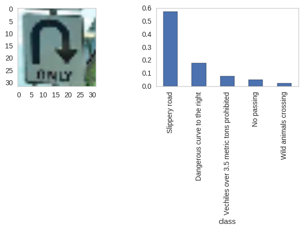

## Traffic Sign Classifier

Classify traffic signs with tensorflow based on a german traffic sign dataset

### Dependencies
**Python 3.5** 

- [Jupyter](http://jupyter.org/)
- [NumPy](http://www.numpy.org/)
- [SciPy](https://www.scipy.org/)
- [scikit-learn](http://scikit-learn.org/)
- [TensorFlow](http://tensorflow.org)
- [Matplotlib](http://matplotlib.org/)
- [Pandas](http://pandas.pydata.org/) (Optional)

opencv install
- `conda install -c https://conda.anaconda.org/menpo opencv3`

### Dataset

[Download the dataset](https://d17h27t6h515a5.cloudfront.net/topher/2016/November/581faac4_traffic-signs-data/traffic-signs-data.zip). This is a pickled dataset in which we've already resized the images to 32x32.

sample data

### Implementation

No preprocessing was done. I thought about normalizing both the colors and sizes, but I wanted the network to be robust to having off center images and while a stop sign is red, the color recorded is influenced by lighting conditions so I opted to leave everything alone.

The training and testing sets were loaded from the pickle, from there I carved out a random sample roughly 10% of the supplied training data prior to generating fake data for use as validation.

#### New Data

I generated a lot of fake data, in fact most of my training data was fake to help balance the classes. I also wanted the network to be somewhat translation and rotation invariant so I shifted, zoomed, and rotated the training images. I thought about mirroring, skewing, and adjusting color values as well but ultimately did not implement.On the small validation set I achieved 99.4% accuracy

initial class imbalance

#### Architecture
I utilized three convolutional layers each with a max pool operation. layer 1. 5x5 with 32 convolutions layer 2. 5x5 with 64 layer 3. 5x5 with 128
I then flattened all the features out and ran them through a three layer feed forward network. I utilized relu for activation and had a hidden layer size of 256.

To train I used cross entropy for loss along with a regularization penalty for large weights in the convolution and feed forward layers. I used the Adam optimizer. I found for a fixed number of epochs a smaller batch size worked better (more iterations). Increasing the number epochs to keep the number of train iterations constant did not help larger batches. Ultimately I settled on batch size of 64 and trained for 40 epochs. Regularization parameter used was .001.

#### Design process
The process was largely trial and error. I initially made the network large (added layer and increased layer size) enough to perform well on the training set but poorly on the test set. At that time I had not generated any fake data so I could easily check the loss and accuracy on the entire training set quickly. Once the network was big enough to perform well on the training set but poorly on the test set I switched to making fake data. After introducing some shifts and rotations in my data I found increasing the number of convolutions helped. Finally, I added the L2 regularization. Finally after everything was done I ran the model on the validation set.

#### Results

some good results

some bad results

some good generalization (Korean stop sign not in training data)

